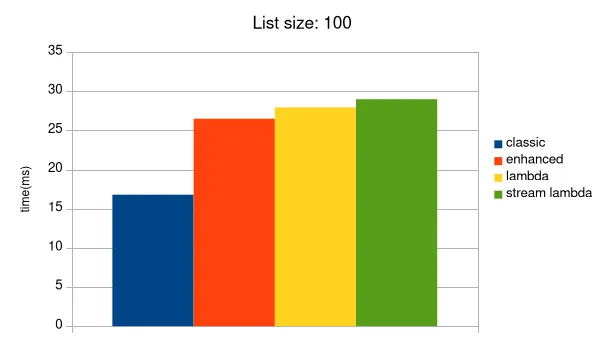
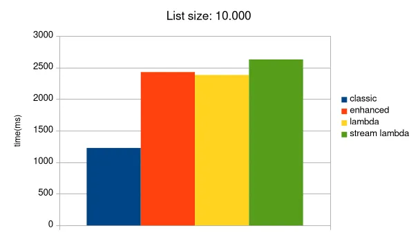
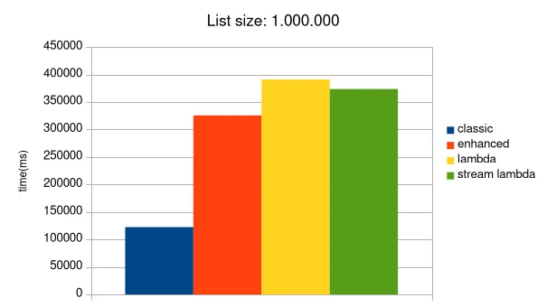

--- 
title: 'Which loop is faster in Java? A classic for loop, an enhanced for-each, or a modern Stream?'
description: "As a recent computer engineering graduate, I often use different types of loops in my personal projects - the classic for, the enhanced for-each, and stream().forEach(). I used them interchangeably without thinking much about their performance. So, I got curious: which one is actually faster?"
date: 2025-09-18
tags: ['software']
lang: 'en'
---


As a recent computer engineering graduate, I often use different types of loops in my personal projects - the classic for, the enhanced for-each, and stream().forEach(). I used them interchangeably without thinking much about their performance. So, I got curious: which one is actually faster?

To find an answer, I decided to run my own benchmark. I measured the execution time of these loops on ArrayLists of various sizes.

My first results were surprising! They suggested that for small lists, the classic for loop was the fastest. But for large datasets (over 1 million elements), it looked like the modern forEach and stream() loops became much more efficient.

I was excited about this discovery, but then something important happened. After sharing my results, a helpful commenter pointed me toward the Java Microbenchmark Harness (JMH). They explained that benchmarking Java code is very tricky. My simple test probably had flaws. For example, I wasn't warming up the JVM's Just-In-Time (JIT) compiler, and the compiler might have been optimizing my code away because it wasn't being used (a problem called "dead code elimination").

To find the real answer, I decided to do it the right way. I rewrote my test using JMH, the industry-standard tool for accurate Java benchmarks.

### The Real Benchmark and the Surprising Truth

My new benchmark properly warms up the JVM and uses a special Blackhole object to ensure the work inside the loop is never eliminated. I tested four methods on ArrayLists with 100, 10,000, and 1,000,000 elements.

The new results were completely different from my first test, and they painted a much clearer picture.







As the JMH results clearly show, the classic for loop is significantly faster than the others for simple iteration over an ArrayList. The performance difference is real and becomes larger as the list size grows.

However, does this mean we should stop using modern loops like forEach and Streams? Absolutely not.

This benchmark only tested one simple task: iterating through every element. The real power of Streams isn't in simple iteration; it's in creating expressive data processing pipelines. We use Streams for their chainable operations like filter(), map(), and reduce(). These features are highly optimized for these specific tasks and allow us to write code that is much more readable than a classic for loop in complex situations.

Imagine trying to filter a list, convert each element to another type, and then collect the results. Using a classic loop would require if statements and temporary lists. A Stream pipeline, in contrast, makes the logic clean and easy to follow.

So, this journey has taught me a valuable lesson and introduced beautiful project named JMH.

Here is code for curious readers.

```java

    @State(Scope.Benchmark)
    @BenchmarkMode(Mode.AverageTime)
    @OutputTimeUnit(TimeUnit.NANOSECONDS)
    @Fork(value = 1)
    @Warmup(iterations = 5)
    @Measurement(iterations = 5)
    public class MyBenchmark {

        @Param({"100", "10000", "1000000"})
        private int listSize;

        private List<Integer> integerList;

        @Setup
        public void setup() {
            integerList = new ArrayList<>(listSize);
            for (int i = 0; i < listSize; i++) {
                integerList.add(i);
            }
        }

        @Benchmark
        public void classicForLoop(Blackhole blackhole) {
            for (int i = 0; i < integerList.size(); i++) {
                blackhole.consume(integerList.get(i));
            }
        }

        @Benchmark
        public void enhancedForLoop(Blackhole blackhole) {
            for (Integer i : integerList) {
                blackhole.consume(i);
            }
        }

        @Benchmark
        public void forEach(Blackhole blackhole) {
            integerList.forEach(blackhole::consume);
        }

        @Benchmark
        public void streamForEach(Blackhole blackhole) {
            integerList.stream().forEach(blackhole::consume);
        }
    }

```