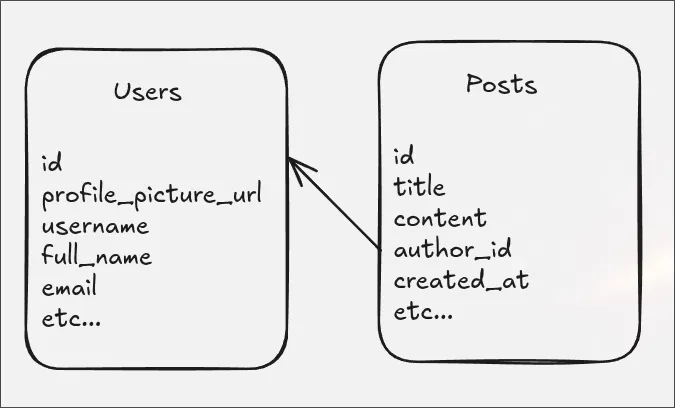
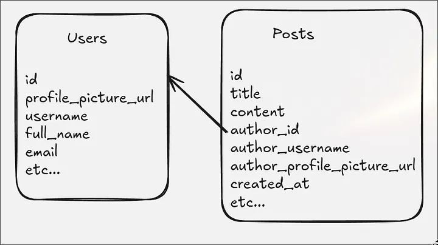

--- 
title: 'Why I Chose Denormalization: A Practical Lesson in System Design Trade-offs'
description: "While I was writing my project, I discovered a bottleneck. I was constantly fetching data from two tables with a JOIN, and this led me to a trade-off. Let’s take a look."
date: 2025-08-22
tags: ['software']
lang: 'en'
---

First, let’s start with what a “trade-off” is.

A trade-off is basically a concept that says not everything can be perfect, and there’s always a balance. For example, if you try to be fast while writing a project, your code quality might drop. Or, if you want a high-performance system, the complexity will increase. In short, it’s about how we can’t gain anything without sacrificing something else.

System Design includes various trade-offs. For example: Consistency vs. Availability, SQL vs. NoSQL, Monolith vs. Microservices, and Performance vs. Cost. The example I faced was Normalization vs. Denormalization. Let’s examine this with a case similar to what I experienced.

Let’s assume you are building a social media platform. You are using an SQL database. You will have two entities: Users and Posts. It would probably look something like this.

### Normalized Design

So, do you think this design is correct? Or does it have a mistake?

One of the things I love most about System Design is that there is no absolute “right” answer. If you gave an answer to my question above, I suggest you think about System Design again. If your first reaction was to ask about the context — to ask under what needs we are discussing if this design is correct — then you have at least earned my respect.

I also started my project with this design, because a normalized database “should” look like this. But I faced a problem. Since it’s a social media app, I needed to fetch the feed constantly. When fetching the posts, I needed the name, username, and profile picture of the person who created the post. This created a situation where I had to perform a JOIN operation all the time. This is where the trade-off appeared.

### Denormalized Design

With this design, there is data replication. The exact same data exists in two tables. This might look bad at first, but it actually solves the bottleneck in one of the most used and stressed parts of the system.

With this post, we learned what a trade-off is in System Design. We saw an example of Normalization vs. Denormalization. And most importantly, we saw that there is no absolute “right” answer in System Design.

I hope you enjoyed reading this.
